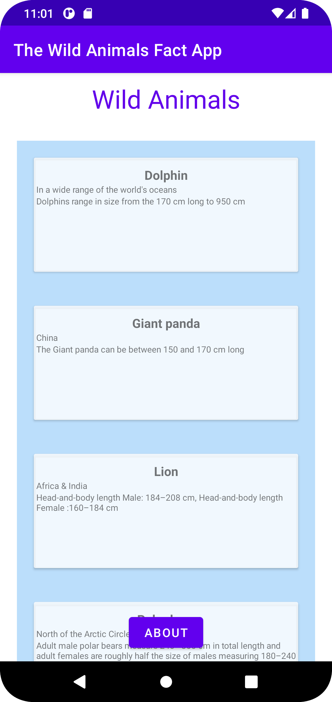
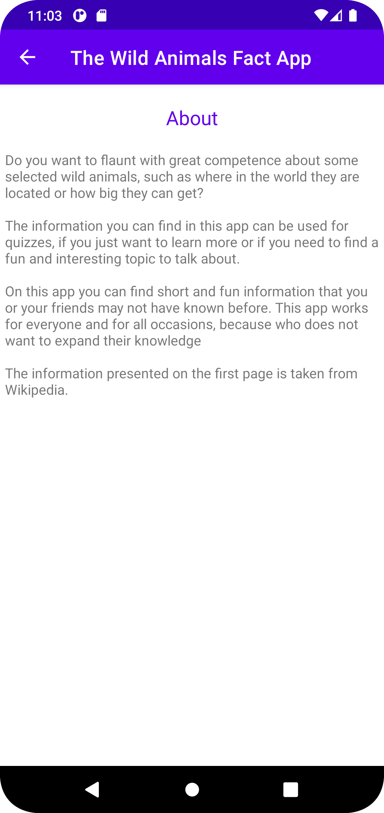

# Rapport 

Jag har skapat en app om Vilda djur. I denna app så finner du lite kort rolig fakta om några utvalda vilda djur. 
Jag började med att skapa en RecyclerView och en TextView i xml. Sedan la jag till en ny layout (animals). 
I denna presenteras de olika djuren och dess information. I denna layout använde jag mig av en ConstraintLayout som jag sedan 
lagt en CardView i och tre olika TextViews för informationen som presenteras. Sedan har jag stylat dessa med hjälp av färger, margin, textSize osv.

Koden nedan visar CardView:n som jag skapat i xml filen animals där datan presenteras. 
```
<androidx.cardview.widget.CardView
        android:layout_width="match_parent"
        android:layout_height="wrap_content"
        android:layout_margin="20dp"
        app:cardBackgroundColor="#CCFFFFFF"
        app:layout_constraintBottom_toBottomOf="parent"
        app:layout_constraintEnd_toEndOf="parent"
        app:layout_constraintStart_toStartOf="parent"
        app:layout_constraintTop_toTopOf="parent">    
```

Efter att jag skapat layouten så började jag att implementera min RecyclerView. Detta gjorde jag i java och började med att lägga till variabeln 
RecycleView i MainActivity, sedan skapade jag en klass för adapter:n (MyAdapter) och en klass för ViewHolder:n (MyViewHolder). Efter det så kopplade jag ihop 
dessa tre med varandra för att bygga ihop RecyclerView:n.

Koden som visas nedan är java och tagen från MainActivity, denna visar hur jag kopplat ihop recyclerView och adapter:n. 
```
 @Override
    protected void onCreate(Bundle savedInstanceState) {
        super.onCreate(savedInstanceState);
        setContentView(R.layout.activity_main);

        adapter = new MyAdapter();
        new JsonTask(this).execute(JSON_URL);

        recyclerView = findViewById(R.id.recycler_view);
        recyclerView.setAdapter(adapter);
        recyclerView.setLayoutManager(new LinearLayoutManager( this));

```
Jag skapade en ArrayList i min adapter för den information som ska presenteras i appen. 
ViewHoler:n kopplade jag ihop med adaper:n och jag skapade även variabler för den JSON data som jag använt mig av. I denna fall name, location och auxdata. 
Dessa satte jag ihop med hjälp av OnBindViewHolder. Jag skapade även en klass för djuren som heter animals där jag lagt in strings och integers samt getters. 

Koden är ifrån klassen MyAdaper som visar hur jag använt mig av OnBindViewHolder.
```
  @Override
    public void onBindViewHolder(@NonNull MyViewHolder holder, int position) {

        holder.name.setText(animals.get(position).getName());
        holder.location.setText(animals.get(position).getLocation());
        holder.info.setText(animals.get(position).getAuxdata());
    }
```

JSON datan som jag skapat la jag till i MainActivity och sedan har jag parsat den med GSON, för att sedan få data:n att visas upp har jag lagt in min ArrayList
och skapat en for loop som loopar igenom alla platser i array:en, detta gör så att djuren presenteras i rätt ordning utifrån listan.

```
   @Override
    public void onPostExecute(String json) {
        Gson gson = new Gson();
        Animals animals[];
        animals = gson.fromJson(json, Animals[].class);
        List<Animals> newAnimals = new ArrayList<>();

        for (int i = 0; i < animals.length; i++) {
            Log.d("MainActivity ==>", "Hittade ett djur:" +animals[i].getName());
            newAnimals.add(animals[i]);
        }

        Log.d("MainActivity", json);
        adapter.setAnimals(newAnimals);
        adapter.notifyDataSetChanged();
    }
    }
```
Sedan skapade jag en till klass och en till layout för en ny sida. Denna sida kallas för about och presenterar en text om vem/vilka som är appens målgrupp.
Denna har jag kopplat ihop med MainAcitivity som då är startsidan. För att användaren ska kunna ta sig mellan sidorna så har jag lagt till en knapp på 
startsidan och sedan lagt till intent. Intent gör så att användaren kommer till about sidan när den klickar på knappen. Eftersom jag även vill att användaren 
ska kunna gå tillbaka till startsidan från about sidan så har jag lagt in en tillbaka pil längst upp i vänstra hörnet. Detta gjorde jag genom att 
lägga till en parentActivityName i Manifest filen. Sist men inte minst så ändrade jag appens namn.

Koden nedan visar hur jag lagt till intent i MainActivity. 
```
 @Override
            public void onClick(View view) {
                Intent intent = new Intent(MainActivity.this, About.class);
                startActivity(intent);
            }
        });
```

Bild på startsidan.


Bild på sidan "om appen" (about sidan).

